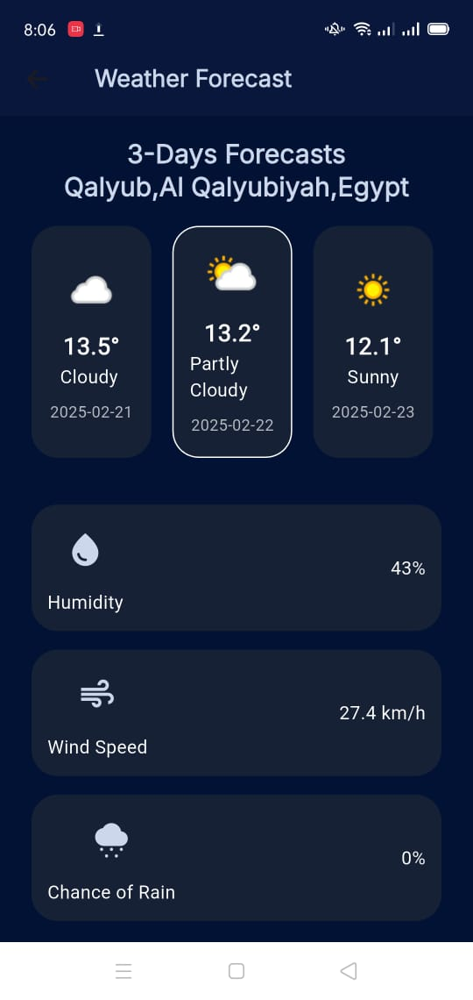
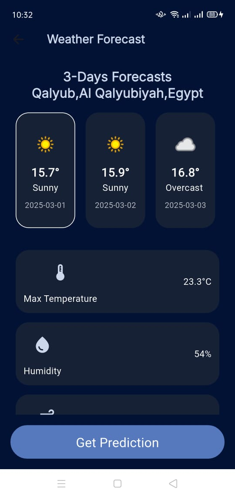
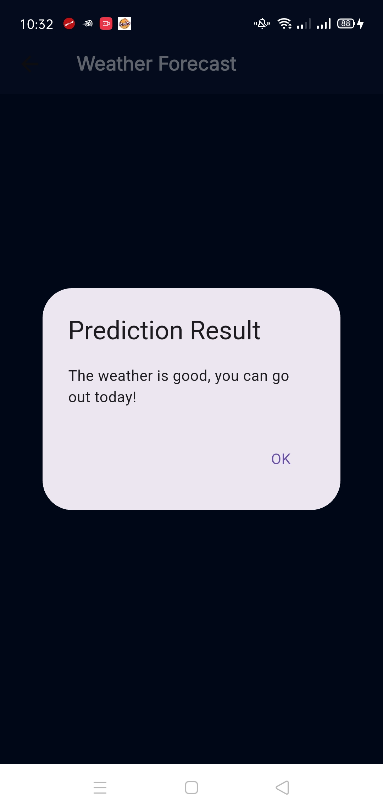

# 🌦️ Weather App

## 📌 Description
A Flutter-based Weather App that provides a **3-day weather forecast** based on the user's location. The app also features an **AI-powered prediction model (Flask)** that determines whether it's safe for the user to go outside. 

## 🚀 Features
- **Automatic Location Detection** – Retrieves weather data based on user's GPS location.
- **3-Day Forecast** – Displays temperature, humidity, wind speed, and other details.
- **AI-Driven Prediction** – Uses a Flask-based AI model to suggest if the user can go out.
- **Clean Architecture & Cubit** – Implements best practices for scalability and maintainability.

## 🏗️ Clean Architecture
The app follows the **Clean Architecture** principles to ensure separation of concerns and maintainability:

### 📌 Layers:
- **Presentation Layer**
  - Handles UI and state management using **Cubit**.
  - Contains widgets, screens, and UI-related logic.
- **Domain Layer**
  - Defines business rules and core logic.
  - Contains **Entities** (core models), **Use Cases** (application logic), and **Repository Interfaces** (contracts for data sources).
- **Data Layer**
  - Handles API calls, data storage, and network interactions.
  - Contains **Models** (data structures), **Repositories** (implementation of domain layer interfaces), and **Data Sources** (remote and local storage).
- **Dependency Injection**
  - Uses **service locators** (e.g., GetIt) to manage dependencies and ensure modular architecture.

## 🛠️ Tech Stack
- **Flutter** – UI framework
- **Cubit** – State management
- **Dio** – API calls
- **Location** – For location services
- **Flask** – AI Model backend
- **REST API** – Weather data retrieval

## 📥 Installation Guide
1. **Clone the repository:**
   ```sh
   git clone https://github.com/RanaUsama20/Tracking-app.git
   cd Tracking-app
   ```
2. **Install dependencies:**
   ```sh
   flutter pub get
   ```
3. **Run the app:**
   ```sh
   flutter run
   ```
4. **Run the Flask backend (AI Model):**
   ```sh
   .\venv\Scripts\Activate
   python app.py
   ```

## 📡 API Endpoints
- **Weather Data API** ( WeatherAPI )
- **AI Prediction API** (`/predict`) – Returns a suggestion based on weather conditions

## Demo 

#### for signUp and signIn

```
https://drive.google.com/drive/folders/1cSGXa3Dx6USH6RK63qoy3hx-860Jblgw?usp=sharing
```

#### for Api Implementation

```
https://drive.google.com/drive/folders/1wjTa-hM-LqRRgQnN1d45woQPxo-kUnHb?usp=sharing
```

#### for Ai-model Implementation

```
https://drive.google.com/drive/folders/1re5bYHU6EJejp25oM9vTgwdLfnxKKVPy?usp=drive_link
```

## 📸 Screenshots
<p float="left">






</p>
## 👥 Contributing
1. Fork the repository
2. Create a new branch (`feature-xyz`)
3. Commit your changes
4. Push to your fork
5. Submit a pull request


---
🚀 *Made with Flutter & Flask to keep you safe while planning your day!*

