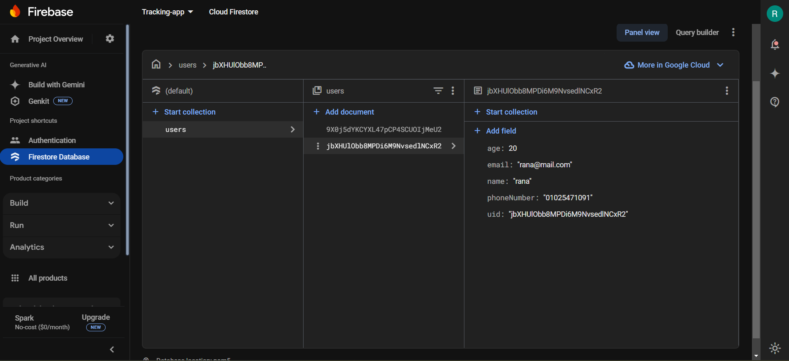
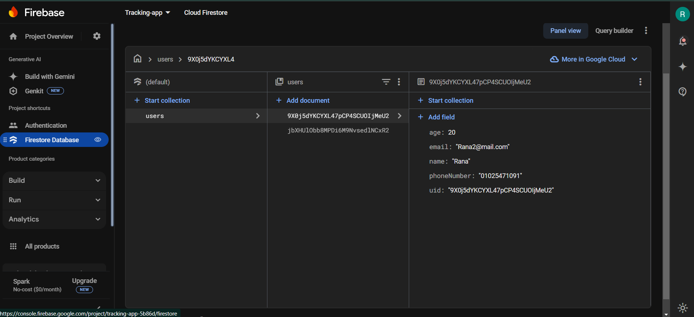
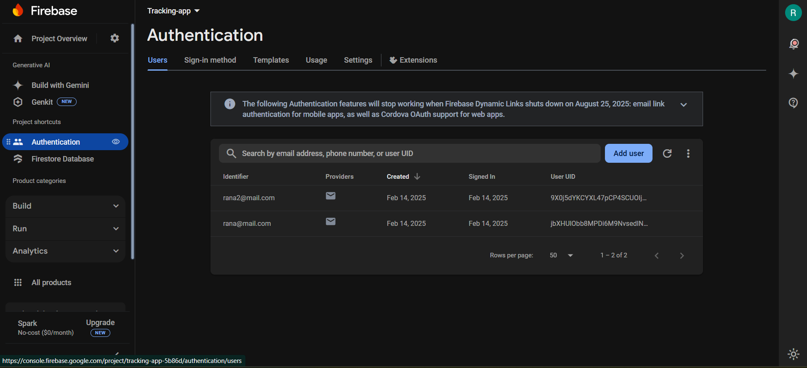
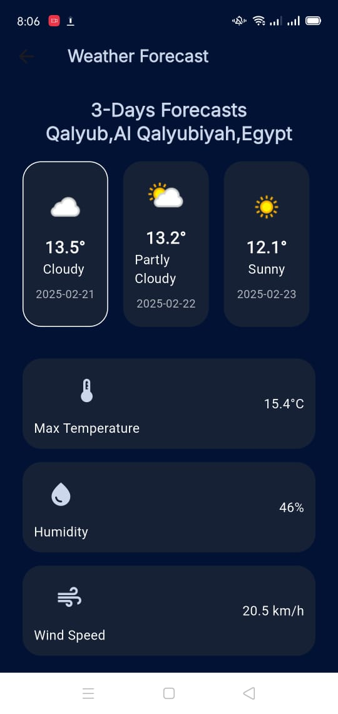

# First Task

Authentication via Firebase.


## Documentation

I used Clean Architecture and Cubit state management 

## Demo 

#### for signUp and signIn

```
https://drive.google.com/drive/folders/1cSGXa3Dx6USH6RK63qoy3hx-860Jblgw?usp=sharing
```

#### for Api Implementation

```
https://drive.google.com/drive/folders/1wjTa-hM-LqRRgQnN1d45woQPxo-kUnHb?usp=sharing
```

## Screenshots
<p float="left">






</p>


`

